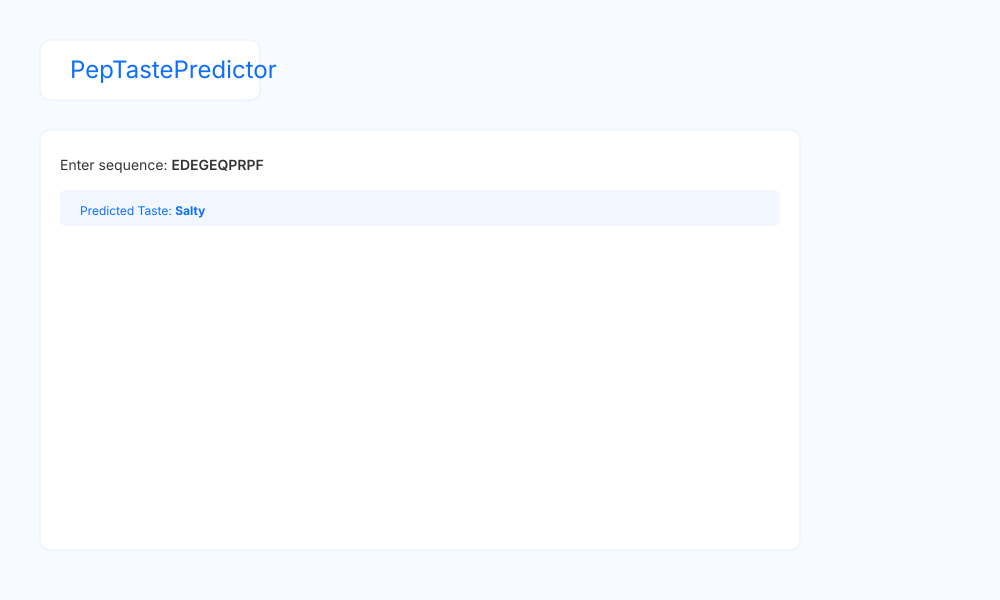

# 🧪 Peptide Taste Predictor

A **Streamlit app** that predicts the taste of peptides (Sweet, Salty, Bitter) from their amino acid sequences using a **Random Forest model** and biochemical descriptors computed with `modlamp`.

---

## **Description**

This app allows users to:

- Predict the taste of a single peptide sequence.
- Upload a file with multiple peptide sequences for **batch prediction**.
- Visualize **feature importance** and **confusion matrix** for the trained model.

It is designed to save time and resources by predicting taste before performing lab experiments.

---

## **Folder Structure**

```

## 🚀 Run locally

1. Create and activate a Python environment (recommended).
2. Install dependencies:

```bash
pip install -r requirements.txt
```

3. Run the app:

```bash
streamlit run PeptideTaste.py
```

## ✨ Improvements

- Polished Streamlit layout with sidebar, hero header, tabs, custom CSS, and an inline logo.
- Improved prediction UI with probability bars and a properties panel.
- Basic validation and safer model load/train flow.
- Added optional **Molecular Docking** support (AutoDock Vina / smina) — upload a receptor and ligand PDB to run docking from the Structure tab.

## 🖼️ Screenshot



## 🧬 Docking / Vina

This project includes helper utilities to run AutoDock Vina or smina when available on your PATH. To install Vina locally on Linux:

```bash
# download and install to ~/.local/bin
curl -L https://github.com/ccsb-scripps/AutoDock-Vina/releases/latest/download/vina_1.2.7_linux_x86_64 -o ~/bin/vina && chmod +x ~/bin/vina
# or follow platform-specific instructions at https://vina.scripps.edu/
```

The app will detect `vina` or `smina` on startup and display the path in the Structure tab. If not found, it will show a helpful error prompting you to install the binary.

## ✅ CI & Tests

Added a basic GitHub Actions workflow that runs pytest and flake8. Unit tests for core functions are in `tests/test_core.py` and docking parsers in `tests/test_docking.py`.

